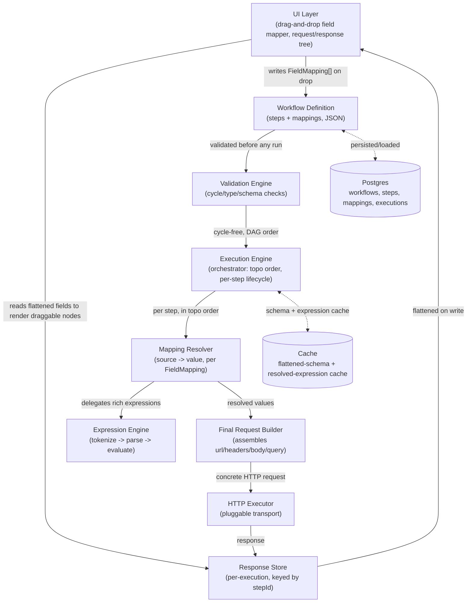

# Dynamic Response-to-Request Mapping Engine — Architecture

A reusable, UI-independent engine for wiring one API step's response fields into
a later step's request (headers/body/query/path), at unlimited nesting depth and
unlimited step count — the core primitive behind an API workflow builder
(Postman Flows / n8n / Boomi-style).

A working reference implementation of the core engine lives in
[`src/workflow-engine/`](../../src/workflow-engine) and is proven against the
exact examples from the feature request in
[`tests/workflow-engine.spec.ts`](../../tests/workflow-engine.spec.ts) (15
passing tests: run `npx playwright test tests/workflow-engine.spec.ts`). This
document describes the full production design — the reference implementation
covers items 1–7, 9–13; items 8 and 14–15 (schema-refresh polling, distributed
caching, horizontal scaling) are designed here but not built, since they need
real infrastructure (a DB, a queue, a cache cluster) to mean anything.

---

## Table of Contents

1. [Overall Architecture](#1-overall-architecture)
2. [Folder Structure](#2-folder-structure)
3. [TypeScript Interfaces](#3-typescript-interfaces)
4. [Database Schema](#4-database-schema)
5. [Mapping Resolver Design](#5-mapping-resolver-design)
6. [JSON Flattening Algorithm](#6-json-flattening-algorithm)
7. [Recursive Parser (Paths)](#7-recursive-parser-paths)
8. [Expression Engine](#8-expression-engine)
9. [Dependency Graph](#9-dependency-graph)
10. [Execution Flow](#10-execution-flow)
11. [Validation Engine](#11-validation-engine)
12. [Error Handling](#12-error-handling)
13. [Performance Optimizations](#13-performance-optimizations)
14. [Caching Strategy](#14-caching-strategy)
15. [Complete Implementation Plan](#15-complete-implementation-plan)

---

## 1. Overall Architecture



**Layering rule:** every arrow points one direction. The UI never resolves a
mapping itself — it only ever renders `FlattenedField[]` and writes
`FieldMapping[]`. The Execution Engine never renders anything — it only
produces `StepResult[]`. This is what makes the engine independently testable
(see the 15 tests) and swappable (a CLI, a scheduled job, or a different UI can
all drive the same engine).

**Why this decomposition, not a monolith:** each box is independently
replaceable —

- Response Store: in-memory `Map` for a single execution → Redis for
  distributed workers processing steps of the *same* execution across
  machines → Postgres for audit/replay of past executions.
- HTTP Executor: `fetch` in production → a recording/replay stub in tests (see
  `tests/workflow-engine.spec.ts`, no network involved).
- Expression Engine: swappable for a full JS sandbox (e.g. `vm2`/`isolated-vm`)
  later without touching the Mapping Resolver's contract.

---

## 2. Folder Structure

Reference implementation (already in this repo):

```
src/workflow-engine/
├── types.ts              # All shared interfaces (§3)
├── flatten.ts             # JSON flattening algorithm (§6)
├── pathResolver.ts         # get/set-by-path recursive parser (§7)
├── expressionEngine.ts      # tokenizer + recursive-descent parser + evaluator (§8)
├── mappingResolver.ts        # FieldMapping -> resolved value (§5)
├── dependencyGraph.ts          # build graph, cycle detection, topo sort (§9)
├── validator.ts                 # type compatibility checks (§11)
├── requestBuilder.ts              # assembles the final HTTP request
├── responseStore.ts                # InMemoryResponseStore (swap for Redis/DB in prod)
├── workflowEngine.ts                # orchestrator: validateWorkflow / executeWorkflow (§10)
└── index.ts                          # public barrel export

tests/
└── workflow-engine.spec.ts    # 15 tests proving every numbered feature, incl.
                                # the prompt's own login/orders/invoice examples

docs/api-workflow-mapping-engine/
└── ARCHITECTURE.md            # this document
```

Full production layout (server + UI would live in sibling services, not this
repo, since this repo is a Playwright test library):

```
workflow-platform/
├── packages/
│   └── mapping-engine/        # = src/workflow-engine/ above, published as an npm package
├── apps/
│   ├── api-server/             # REST/GraphQL API: CRUD workflows, POST /executions
│   │   ├── src/
│   │   │   ├── routes/
│   │   │   ├── db/               # migrations, repositories (§4)
│   │   │   ├── queue/              # BullMQ/SQS worker that calls executeWorkflow()
│   │   │   └── cache/                # Redis client (§14)
│   └── web-ui/                        # React/Vue drag-and-drop mapper
│       ├── src/
│       │   ├── components/FieldTree/    # renders FlattenedField[] as draggable nodes
│       │   ├── components/Canvas/         # step nodes + connection lines
│       │   └── store/                       # calls the API server, never the engine directly
└── infra/
    ├── migrations/
    └── docker-compose.yml
```

---

## 3. TypeScript Interfaces

Full source: [`src/workflow-engine/types.ts`](../../src/workflow-engine/types.ts). Key shapes:

```ts
export type JsonPrimitive = string | number | boolean | null;
export type JsonValue = JsonPrimitive | JsonValue[] | { [key: string]: JsonValue };
export type FieldType = 'string' | 'number' | 'boolean' | 'null' | 'object' | 'array' | 'undefined';

export interface FlattenedField {
  path: string;              // "data.users[0].orders[0].items[0].price"
  value: JsonValue | undefined;
  type: FieldType;
}

export interface WorkflowStep {
  id: string;
  name: string;
  method: string;
  url: string;                        // may itself contain {{stepX...}} tokens
  headers?: Record<string, string>;
  body?: JsonValue;
  queryParams?: Record<string, string>;
  pathParams?: Record<string, string>;
  mappings: FieldMapping[];
}

export type MappingTarget = 'body' | 'headers' | 'queryParams' | 'pathParams';

export interface FieldMapping {
  target: MappingTarget;
  targetPath: string;                  // "customer.address.city"
  source?: string;                      // "step1.response.customer.id"
  expression?: string;                   // "{{step1.response.firstName}} {{step1.response.lastName}}"
  transform?: string;                     // "Bearer ${value}" — applied after `source` resolves
  expectedType?: FieldType;
  optional?: boolean;
}

export interface StepResult {
  stepId: string;
  request: { method: string; url: string; headers: Record<string, string>; body?: JsonValue };
  response: JsonValue;
  status: number;
  flattenedResponse: FlattenedField[];   // precomputed once, not on every UI render
  durationMs: number;
  executedAt: string;
}

export interface ResponseStore {
  get(stepId: string): StepResult | undefined;
  set(stepId: string, result: StepResult): void;
  has(stepId: string): boolean;
  all(): Record<string, StepResult>;
}

export interface HttpExecutor {
  execute(request: { method: string; url: string; headers: Record<string, string>; body?: JsonValue })
    : Promise<{ status: number; body: JsonValue }>;
}
```

---

## 4. Database Schema

Postgres, normalized so a single mapping can be queried/edited without
rewriting a whole workflow's JSON blob (needed once workflows have hundreds of
steps/mappings and the UI does field-level autosave on drag).

```sql
-- A workflow is a named, versioned collection of steps.
CREATE TABLE workflows (
    id            UUID PRIMARY KEY DEFAULT gen_random_uuid(),
    name          TEXT NOT NULL,
    description   TEXT,
    version       INT  NOT NULL DEFAULT 1,
    created_by    UUID NOT NULL REFERENCES users(id),
    created_at    TIMESTAMPTZ NOT NULL DEFAULT now(),
    updated_at    TIMESTAMPTZ NOT NULL DEFAULT now()
);

-- One row per step. `step_key` is the stable "step1"-style id used in mapping
-- source strings — NOT the surrogate PK, so reordering steps in the UI never
-- breaks existing mapping references.
CREATE TABLE workflow_steps (
    id            UUID PRIMARY KEY DEFAULT gen_random_uuid(),
    workflow_id   UUID NOT NULL REFERENCES workflows(id) ON DELETE CASCADE,
    step_key      TEXT NOT NULL,             -- "step1", "step2", ...
    name          TEXT NOT NULL,
    method        TEXT NOT NULL,
    url           TEXT NOT NULL,
    headers       JSONB NOT NULL DEFAULT '{}',
    body          JSONB,
    query_params  JSONB NOT NULL DEFAULT '{}',
    path_params   JSONB NOT NULL DEFAULT '{}',
    position      INT  NOT NULL,             -- UI canvas ordering only, NOT execution order
    UNIQUE (workflow_id, step_key)
);

-- One row per drag-and-drop connection. Normalized (not embedded in
-- workflow_steps.body as JSON) so validation/dependency-graph queries don't
-- need to parse every step's JSON body on every load.
CREATE TABLE field_mappings (
    id              UUID PRIMARY KEY DEFAULT gen_random_uuid(),
    step_id         UUID NOT NULL REFERENCES workflow_steps(id) ON DELETE CASCADE,
    target          TEXT NOT NULL CHECK (target IN ('body','headers','queryParams','pathParams')),
    target_path     TEXT NOT NULL,
    source          TEXT,                      -- "step1.response.user.id"
    expression      TEXT,
    transform       TEXT,
    expected_type   TEXT CHECK (expected_type IN ('string','number','boolean','null','object','array','undefined')),
    is_optional     BOOLEAN NOT NULL DEFAULT false,
    CHECK (source IS NOT NULL OR expression IS NOT NULL)
);

-- One row per workflow run.
CREATE TABLE workflow_executions (
    id            UUID PRIMARY KEY DEFAULT gen_random_uuid(),
    workflow_id   UUID NOT NULL REFERENCES workflows(id),
    workflow_version INT NOT NULL,             -- pin to the version run, even if the workflow is edited later
    status        TEXT NOT NULL CHECK (status IN ('pending','running','succeeded','failed')),
    started_at    TIMESTAMPTZ NOT NULL DEFAULT now(),
    finished_at   TIMESTAMPTZ
);

-- One row per executed step within a run — the durable form of StepResult,
-- used for replay/debugging/audit ("what did step3 actually receive?").
CREATE TABLE step_results (
    id              UUID PRIMARY KEY DEFAULT gen_random_uuid(),
    execution_id    UUID NOT NULL REFERENCES workflow_executions(id) ON DELETE CASCADE,
    step_key        TEXT NOT NULL,
    request         JSONB NOT NULL,
    response        JSONB,
    status          INT,
    duration_ms     INT,
    executed_at     TIMESTAMPTZ NOT NULL DEFAULT now(),
    error           JSONB                        -- populated on a failed step (see §12)
);

-- Cached flattened schema per step per workflow VERSION, so the UI can list
-- draggable fields without re-executing the workflow every time it's opened
-- (§8/feature-8: refreshed whenever a step actually re-runs with a new shape).
CREATE TABLE step_schema_cache (
    workflow_id   UUID NOT NULL REFERENCES workflows(id) ON DELETE CASCADE,
    step_key      TEXT NOT NULL,
    schema_hash   TEXT NOT NULL,               -- hash of the flattened path/type list, for change detection
    flattened     JSONB NOT NULL,              -- FlattenedField[] with `value` stripped (schema only)
    updated_at    TIMESTAMPTZ NOT NULL DEFAULT now(),
    PRIMARY KEY (workflow_id, step_key)
);

CREATE INDEX idx_field_mappings_step ON field_mappings(step_id);
CREATE INDEX idx_step_results_execution ON step_results(execution_id);
CREATE INDEX idx_workflow_steps_workflow ON workflow_steps(workflow_id);
```

---

## 5. Mapping Resolver Design

Implementation: [`mappingResolver.ts`](../../src/workflow-engine/mappingResolver.ts).

Responsibilities, strictly bounded:

1. Turn `"step1.response.user.company.id"` into a live lookup by splitting off
   the step id (segment 0) and section (segment 1 — `response` / `request` /
   `status`), then delegating the remaining path to the recursive path parser
   (§7) against that step's stored data.
2. Decide whether `source` needs the full expression parser at all — a bare
   reference like `step1.response.accessToken` skips tokenizing/parsing
   entirely (`resolveDirect`) and only pays for the expression engine when the
   string actually contains `{{ }}`, an operator, or a function call. This
   matters at scale: most mappings in a real workflow are bare references, not
   expressions.
3. Apply `transform` (a `${value}` template) *after* `source` resolves — kept
   separate from `expression` so the common "wrap this one value" case (Bearer
   tokens, prefixes/suffixes) doesn't need the full expression grammar.
4. Never throw for `optional: true` mappings — return `undefined` and let the
   Request Builder simply omit that field.
5. Collect (not fail-fast on) errors across a whole step's mappings
   (`resolveStepMappings`), so a single broken mapping doesn't hide two other
   broken mappings — the UI needs to show all of them at once.

```ts
export function resolveMapping(mapping: FieldMapping, store: ResponseStore): JsonValue | undefined {
  const resolve = makeIdentifierResolver(store);
  if (mapping.expression) return resolveTemplate(mapping.expression, resolve);
  if (mapping.source) {
    const value = mapping.source.includes('{{')
      ? resolveTemplate(mapping.source, resolve)
      : resolveDirect(mapping.source, resolve);
    return mapping.transform ? applyValueTemplate(mapping.transform, value) : value;
  }
  throw new Error('mapping has neither `source` nor `expression`');
}
```

---

## 6. JSON Flattening Algorithm

Implementation: [`flatten.ts`](../../src/workflow-engine/flatten.ts).

A single recursive walk, three cases per node:

- **Array** → empty array is its own leaf node (`type: 'array'`, so the UI can
  show "this field is an empty list"); non-empty recurses into each index
  with `path[i]` appended.
- **Object** → empty object is its own leaf node (`type: 'object'`);
  non-empty recurses into each key with `path.key` appended.
- **Anything else** (`string`/`number`/`boolean`/`null`/`undefined`) → a real
  leaf, pushed as-is.

```ts
function walk(value, path) {
  const t = typeOf(value);
  if (t === 'array') {
    const arr = value;
    if (arr.length === 0) return push({ path, value: arr, type: 'array' });
    arr.forEach((item, i) => walk(item, `${path}[${i}]`));
    return;
  }
  if (t === 'object') {
    const keys = Object.keys(value);
    if (keys.length === 0) return push({ path, value, type: 'object' });
    for (const key of keys) walk(value[key], path ? `${path}.${key}` : key);
    return;
  }
  push({ path, value, type: t }); // primitive / null / undefined
}
```

Correctness is unconditional on depth or shape — there is no special-casing
for "arrays of arrays" or "objects inside arrays"; those fall out naturally
because every recursive call re-dispatches on the *current* node's type,
regardless of what shape produced it. Proven directly in the tests against
`data.users[0].orders[0].items[0].price` (object → array → object → array →
object → primitive, five levels) and against an array-of-arrays / object-in-
array combination.

**Complexity:** O(total number of leaf + container nodes) time and space —
one push per leaf/empty-container, no re-visiting. For a response with N
total JSON nodes this is O(N), the theoretical minimum for "produce every
path".

---

## 7. Recursive Parser (Paths)

Implementation: [`pathResolver.ts`](../../src/workflow-engine/pathResolver.ts).

`"data.users[0].orders[0].items[0].price"` is tokenized with one regex pass
into typed segments —

```ts
type PathSegment = { kind: 'key'; key: string } | { kind: 'index'; index: number };
const re = /([^[.\]]+)|\[(\d+)\]/g;
```

then two functions walk the segment list against a live JSON value:

- `getByPath(root, path)` — returns `undefined` on any missing/wrong-type step
  (array index into a non-array, key into a non-object) instead of throwing.
  This is deliberate: a response field that's merely *absent this run*
  (optional property, or a shorter array than last time) should surface as
  "no value", not crash the whole resolution pass.
- `setByPath(root, path, value)` — the inverse, used by the Request Builder.
  Creates intermediate objects/arrays on the way down (looking one segment
  ahead to know whether the next container should be `{}` or `[]`), so
  `setByPath({}, "customer.address.city", "Chennai")` builds the whole nested
  shape in one call.

---

## 8. Expression Engine

Implementation: [`expressionEngine.ts`](../../src/workflow-engine/expressionEngine.ts).

A small, closed grammar — not a general scripting language — precisely so a
workflow definition (which may come from an untrusted template imported from
another org) can never do more than read values and combine them:

```
primary    := NUMBER | STRING | TRUE | FALSE | NULL | IDENT | IDENT '(' args ')' | '(' expr ')'
unary      := ('!' | '-') unary | primary
multiplicative := unary (('*' | '/') unary)*
additive   := multiplicative (('+' | '-') multiplicative)*
comparison := additive (('==' | '!=' | '<' | '<=' | '>' | '>=') additive)*
logical    := comparison (('&&' | '||') comparison)*
expr       := logical
```

- **Tokenizer**: single left-to-right scan producing `num` / `str` / `ident`
  (dotted paths, including `[n]`) / `op` / paren / comma tokens.
- **Parser**: hand-written recursive descent, one function per precedence
  level (standard technique — no parser-generator dependency, ~150 lines,
  easy to audit line-by-line for a security review).
- **Built-ins**: `today()`, `now()`, `concat(...)`, `upper()`, `lower()`,
  `toNumber()`, `toString()`, `if(cond, a, b)` — a fixed table, not
  user-extensible, so the attack surface is enumerable.
- **Identifiers** resolve through an injected `IdentifierResolver` — the
  expression engine has zero knowledge of `ResponseStore`; `mappingResolver.ts`
  supplies the resolver that actually knows how to look a step id up.

**Template interpolation** (`resolveTemplate`) is a separate, simpler layer on
top: a template that is *exactly* one `{{...}}` token returns the resolved
value with its original type preserved (`{{step1.response.user.id}}` → the
number `15`, not the string `"15"`); anything with surrounding text
(`"{{first}} {{last}}"`, `"Bearer {{token}}"`) is string-interpolated. This
matches both worked examples in the prompt exactly (concatenation with a
space, and the Bearer-prefix case) without the caller needing to know which
mode applies — it's inferred from the template shape.

---

## 9. Dependency Graph

Implementation: [`dependencyGraph.ts`](../../src/workflow-engine/dependencyGraph.ts).

1. **Build**: for every step, scan every mapping's `source`/`expression`
   string for identifiers that match a known step id (`referencedStepIds`),
   producing `stepId -> Set<dependsOnStepId>`.
2. **Cycle detection**: classic DFS 3-color algorithm (white/gray/black). A
   gray node reached again means a cycle; the path array at that point *is*
   the cycle, reported verbatim in `CircularDependencyError` (e.g.
   `step2 -> step3 -> step2`).
3. **Topological order**: Kahn's algorithm (in-degree counting + queue) —
   chosen over a second DFS pass because it naturally detects "leftover
   nodes" (a cycle) as a distinct failure mode from the DFS check, giving two
   independent confirmations in production rather than trusting one
   algorithm's edge cases.

This also means the engine does **not** require steps to be declared in
execution order — `buildDependencyGraph` + `topologicalOrder` compute the
correct order from the mappings alone, so a user reordering steps visually in
the UI can never silently break execution order.

---

## 10. Execution Flow

Implementation: [`workflowEngine.ts`](../../src/workflow-engine/workflowEngine.ts).

```
validateWorkflow(steps)
  ├─ every mapping's referenced step id must exist in this workflow → else WorkflowValidationError
  ├─ buildDependencyGraph + detectCycles → else CircularDependencyError
  └─ returns topologicalOrder

executeWorkflow(steps, httpExecutor)
  1. order = validateWorkflow(steps).order
  2. for stepId in order:
       a. resolved, errors = resolveStepMappings(step.mappings, store)
       b. if errors.length > 0 → throw WorkflowValidationError(errors)   [fail before any request for THIS step]
       c. collect type-mismatch warnings (non-fatal)
       d. request = buildRequest(step, resolved)
       e. { status, body } = await httpExecutor.execute(request)
       f. store.set(stepId, { ...request, response: body, flattenedResponse: flattenJson(body), ... })
  3. return { store, order, warnings }
```

Failure is per-step and immediate — step *N*'s HTTP call never fires if step
*N*'s own mappings didn't all resolve, but steps 1..N-1 have already run and
their results remain in the store (useful for the UI to show "this far, then
it broke").

---

## 11. Validation Engine

Implementation: [`validator.ts`](../../src/workflow-engine/validator.ts) (types)
+ the structural checks inside `validateWorkflow` (missing-step, cycles).

Three independent validation passes, each producing `ValidationIssue[]` with
a `code` so the UI can render a specific message/icon per failure kind:

| Code | Severity | When |
|---|---|---|
| `MISSING_STEP` | error | A mapping references a step id absent from the workflow |
| `CIRCULAR_DEPENDENCY` | error | Steps depend on each other in a loop |
| `UNRESOLVED_REFERENCE` | error | A non-optional mapping's source/expression resolved to nothing at run time |
| `TYPE_MISMATCH` | warning | Resolved value's actual type doesn't match `expectedType` (numeric-looking strings and `"true"`/`"false"` are treated as compatible with `number`/`boolean`, since APIs routinely stringify) |
| `EXPRESSION_ERROR` | error | The expression parser/evaluator itself threw (bad syntax, unknown function) |
| `SCHEMA_CHANGED` | warning | (§14) A step's response shape differs from its last cached schema |

Type mismatches are warnings, not hard failures, by design — real-world APIs
routinely return `"42"` where a strict schema says `number`; failing the whole
workflow over that would make the tool unusable against real backends. Missing
steps and cycles ARE hard failures, thrown *before* the first HTTP call, since
those are authoring mistakes with no valid execution semantics at all.

---

## 12. Error Handling

Three custom error classes, each carrying structured data (not just a
message string) so the UI can point at the exact broken node:

```ts
class WorkflowValidationError extends Error { issues: ValidationIssue[] }
class CircularDependencyError extends Error { cycle: string[] }        // e.g. ["step2","step3","step2"]
class MappingResolutionError extends Error { mapping: FieldMapping }
```

Rules:

- **Fail fast on structural problems** (missing step reference, cycle) —
  these can never be fixed by retrying, so they're thrown by
  `validateWorkflow` before any network call.
- **Fail per-step on resolution problems** — a step's own broken mapping
  stops that step (and everything after it, since later steps may depend on
  it), but every prior step's `StepResult` is preserved in the store for
  debugging.
- **Never fail on `optional: true`** mappings — resolves to `undefined`,
  silently omitted by the Request Builder.
- **HTTP failures are not this engine's concern** — a non-2xx response is
  still a valid `StepResult` (the `status` field carries it); the *workflow
  author* decides whether that halts the chain (e.g. a mapping like
  `if(step1.response.status == 200, ..., ...)` in a later step), matching how
  Postman Flows/n8n treat HTTP errors as data, not exceptions.

---

## 13. Performance Optimizations

1. **Flatten once per step, not per UI render.** `flattenJson` runs exactly
   once, inside `executeWorkflow`, right after the response arrives; the
   result is stored on `StepResult.flattenedResponse`. The UI never re-walks
   a multi-megabyte response on every re-render.
2. **Skip the expression parser for bare references.** `resolveDirect` in
   `mappingResolver.ts` short-circuits before tokenizing when a `source`
   string has no operator/paren/quote — the overwhelmingly common case
   (`"step1.response.accessToken"`) never touches the parser at all.
3. **O(N) flattening, O(path length) lookups.** No quadratic behavior anywhere
   in the hot path — flattening is linear in response size; `getByPath`/
   `setByPath` are linear in the *path's* length, not the object's size.
4. **Topological order computed once per execution**, not recomputed per
   step — `validateWorkflow` runs once at the top of `executeWorkflow`.
5. **For "millions of executions"**: the engine itself is pure/stateless
   (no globals, no shared mutable state between calls to `executeWorkflow`)
   — horizontal scaling is "run more worker processes," not an architecture
   change. Each execution's `ResponseStore` is scoped to that one execution.

---

## 14. Caching Strategy

Three distinct cache layers, each with a different key and invalidation rule
(not one generic cache — they have different lifetimes):

| Cache | Key | Value | Invalidation |
|---|---|---|---|
| **Schema cache** (`step_schema_cache` table / Redis mirror) | `workflowId + stepKey` | `FlattenedField[]` shape only (paths + types, no values) | Recomputed whenever a step actually executes; compared by `schema_hash` — if the new flatten produces a different set of paths/types than the cached one, mark `SCHEMA_CHANGED` (feature #8) and refresh |
| **Compiled expression cache** | hash of the expression string | Parsed AST (skip re-tokenizing/re-parsing the same expression string on every execution of a frequently-run workflow) | Never expires (expressions are immutable text) — evict by LRU capacity only |
| **Execution-scoped response cache** | `executionId + stepId` | Full `StepResult` (this is just the `ResponseStore`, described as a cache because in a distributed-worker setup it's backed by Redis, not memory, so any worker handling step N+1 can read step N's result) | Deleted when the execution completes (TTL = execution lifetime + a short grace period for UI replay) |

**Why schema cache matters for feature #8** ("if an API changes its schema,
automatically refresh the available response fields"): the UI should not have
to re-execute a whole workflow just to see updated draggable fields. Instead:
on every real execution, compare the freshly flattened schema against
`step_schema_cache`; on a mismatch, update the cache row and emit a
`SCHEMA_CHANGED` validation warning for any *existing* mapping whose
`targetPath`'s source path is no longer present in the new schema — turning a
silent breakage into a visible warning the next time the workflow is opened.

---

## 15. Complete Implementation Plan

**Phase 0 — Core engine (done in this repo).**
`src/workflow-engine/*` + `tests/workflow-engine.spec.ts`. Flattening, path
resolution, expression engine, mapping resolver, dependency graph, validator,
request builder, in-memory response store, execution orchestrator. No UI, no
DB, no real HTTP — proven with an injectable `HttpExecutor` stub.

**Phase 1 — Persistence.**
Stand up the Postgres schema (§4). Repository layer:
`WorkflowRepository.load(id) -> WorkflowStep[]` (joins `workflow_steps` +
`field_mappings`), `ExecutionRepository.save(result)` (writes
`workflow_executions` + `step_results`). No engine changes needed — the
engine's input/output types already match this shape 1:1.

**Phase 2 — Real HTTP executor + API server.**
A thin `FetchHttpExecutor implements HttpExecutor` using `fetch`/`axios`. A
REST endpoint `POST /workflows/:id/executions` that loads the workflow,
calls `executeWorkflow`, persists the result, and returns the execution id.
A `GET /executions/:id` endpoint for polling/streaming step-by-step progress
(SSE or WebSocket, one event per completed `StepResult`).

**Phase 3 — Schema cache + change detection (feature #8).**
`step_schema_cache` table wired into the executor's post-step hook: after
`flattenJson`, hash the `(path,type)` pairs, compare/update the cache row,
and attach `SCHEMA_CHANGED` warnings for mappings whose source path vanished.

**Phase 4 — Async execution + queue.**
For long-running or many-step workflows, move `executeWorkflow` off the
request thread: `POST /executions` enqueues a job (BullMQ/SQS), a worker pool
calls the same `executeWorkflow`, writing `StepResult`s incrementally so the
UI can subscribe mid-run. The engine itself needs zero changes — it was
already async/await and side-effect-free beyond the injected store/executor.

**Phase 5 — UI (field mapper).**
React canvas: one node per step showing its `flattenedResponse` as a
draggable tree (grouped by path prefix for large responses — see below);
drop targets on the next step's header/body/query/path fields, writing
`FieldMapping[]` via the API. The UI calls `validateWorkflow` (exposed as a
dry-run endpoint) on every edit for instant cycle/missing-step feedback,
without executing anything.

**Phase 6 — Expression builder UI + richer functions.**
A small expression editor (autocomplete over available step paths + the
built-in function table) on top of the same `evaluateExpression`/
`resolveTemplate` used by the engine. Additional built-ins (date formatting,
`length()`, `contains()`) are pure additions to the `BUILTINS` table — no
grammar changes.

**Phase 7 — Scale hardening.**
Redis-backed `ResponseStore` implementation (same `ResponseStore` interface,
so `workflowEngine.ts` is untouched) for distributed step execution across
workers. Compiled-expression LRU cache (§14). Load-test with synthetic
100-step workflows and megabyte-scale responses to confirm the O(N)
flattening/lookup bounds hold in practice, not just in complexity analysis.

**Large-response UI note (not an engine concern, but worth flagging early):**
for a response with thousands of leaf fields (deeply nested arrays), the UI
should lazily expand the field tree by path prefix rather than rendering every
`FlattenedField` at once — the engine already gives it a flat list, so this is
a pure rendering decision, not something `flattenJson` needs to change to
support.
